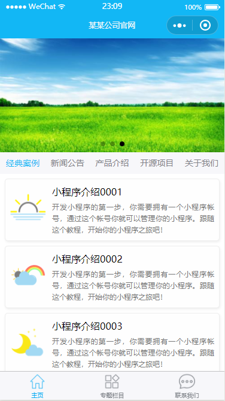
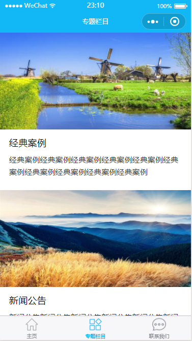
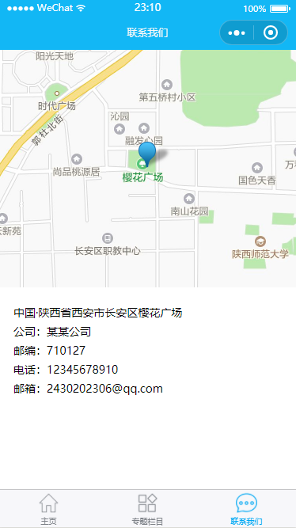
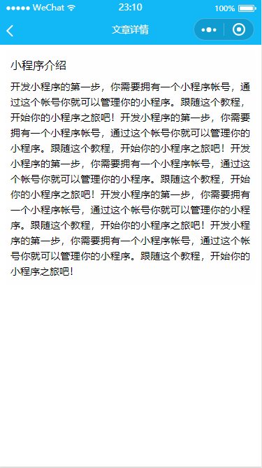

# app-cms

#### 项目介绍
app-cms是一个简易的CMS网站项目，基于微信小程序开发，适用于简易的公司官网，定位于学习型练手项目。

#### 使用说明

1. 下载代码，使用微信开发者工具打开
2. 将`project.config.json`中的`appid`替换为你自己的[非必需]

#### 目录结构

```
├── images                   //图片文件夹
├── pages                    //页面
│   └── index   	  //首页
│   └── subject		  //专题栏目页
│   └── contact		  //联系我们页
│   └── article		  //文章详情页
│   └── articles	  //文章列表页
|── utils                   //工具类
│   ├── util.js       //工具
|—— app.js                  //小程序逻辑
|—— app.json                //小程序公共设置
|—— app.wxss                //小程序公共样式表
|—— project.config.json     //小程序工具配置
```

#### 参考
1. [微信小程序官方教程](https://developers.weixin.qq.com/miniprogram/dev/quickstart/basic/file.html)
2. [界面参考](https://gitee.com/jeecg/jeewx-app-cms)


#### 功能截图






#### 关于作者
一名Java后端开发程序员，乐于接触新技术新方向！
